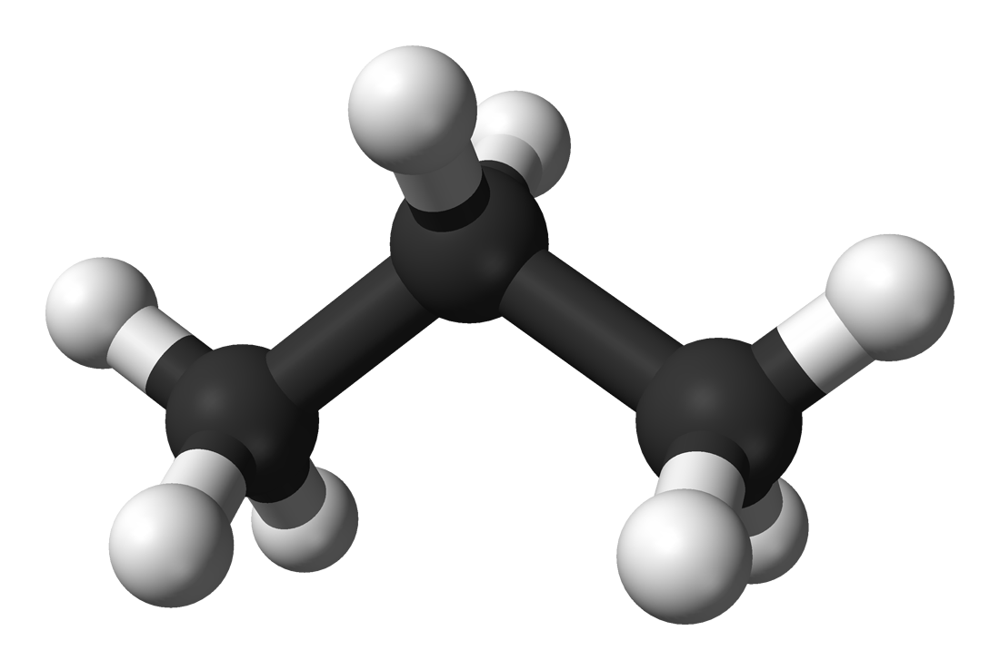
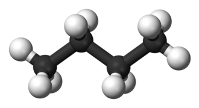

# sensor-de-gas
objetivo do projeto: medir o aumento de gas no ambiente, e alertar com som, principalmente feito para minha vó.

## tecnologia

- C++
- Arduino

## circuito

Para garantir a precisão, o código utiliza a variável limiteAlerta. Durante os testes em ambiente limpo, observou-se uma leitura base de 465. O limite de disparo foi definido em 500 para evitar alarmes falsos causados por ruídos elétricos ou variações naturais de umidade, mantendo uma margem de segurança.

## GLP (gás liquefeito de pretróleo)

O gás liquefeito de petróleo (GLP), também chamado de gás de petróleo liquefeito (GPL) e conhecimento coloquialmente como gás de cozinha no Brasil, é uma mistura de gases de hidrocarbonetos utilizado como combustível em aplicações de aquecimento (como em fogões) e veículos.

O GLP ou GPL é a mistura de gases condensáveis presentes no gás natural ou dissolvidos no petróleo. Os componentes do GLP, embora à temperatura e pressão ambientais sejam gases, são fáceis de condensar. Na prática, pode-se dizer que o GLP é uma mistura dos gases propano e butano.

O GLP (Gás Liquefeito de Petróleo) não é uma única molécula, mas uma mistura de hidrocarbonetos, principalmente propano (C3H8
) e butano (C4H10
). São moléculas alifáticas da família dos alcanos, obtidas do refino do petróleo ou gás natural, que se tornam líquidas sob pressão para transporte e armazenamento em botijões.

#### Por que é perigoso?

Asfixia: O GLP é mais pesado que o ar. Em caso de vazamento, ele se acumula próximo ao chão, expulsando o oxigênio do ambiente.

Inflamabilidade: Ele possui um alto poder calorífico. Uma pequena faísca (até de um interruptor de luz) pode causar uma explosão se a concentração no ar estiver entre 1.8% e 9.5%.

Inodoro (Originalmente): O GLP puro não tem cheiro. O "cheiro de gás" que sentimos vem de um aditivo chamado Mercaptana, colocado exatamente para que possamos detectar vazamentos pelo olfato.

https://pt.wikipedia.org/wiki/G%C3%A1s_liquefeito_de_petr%C3%B3leo

## Propano e Butano

### Propano

Um alcano de três carbonos, propano é algumas vezes derivado de outros produtos do petróleo, durante processamento de óleo ou gás natural.

#### Usos
Quando comburente vendido como combustível, ele também é chamado de gás liquefeito de petróleo (GLP), que é uma mistura do propano com pequenas quantidades de propileno, butano e butileno, mais etanotiol como odorizante para impedir que o normalmente inodoro propano deixe de ser identificado quando em vazamentos. Ele é usado como combustível para fogões e em motores de automóveis.

A combustão do propano é uma reação tipicamente exotérmica com desprendimento de calor:

C3H8 + 5 O2 → 3 CO2 + 4 H2O

https://pt.wikipedia.org/wiki/Propano

### Butano

O butano é um hidrocarboneto saturado da família dos alcanos e de fórmula C4H10. É obtido mediante o aquecimento lento do petróleo. É um gás incolor, inodoro e altamente inflamável. Existe sob duas formas isômeras: o n-butano e o isobutano ou 2-metilpropano.

#### Utilização
O butano está presente no gás liquefeito de petróleo (o gás de cozinha, fornecido via tubulação ou em botijões), que é uma mistura de gases, cujo principal componente é o propano.

Uma vez que o butano é inodoro, por convenção - e para que possamos distingui-lo de outro gás - adiciona-se a ele uma substância de cheiro específico (etanotiol). O vazamento de gás butano pode produzir asfixia, por expulsar o oxigênio do ambiente, pois, ao contrário da maioria dos gases, a densidade do butano corresponde a aproximadamente o dobro da densidade do ar atmosférico.

https://pt.wikipedia.org/wiki/Butano
